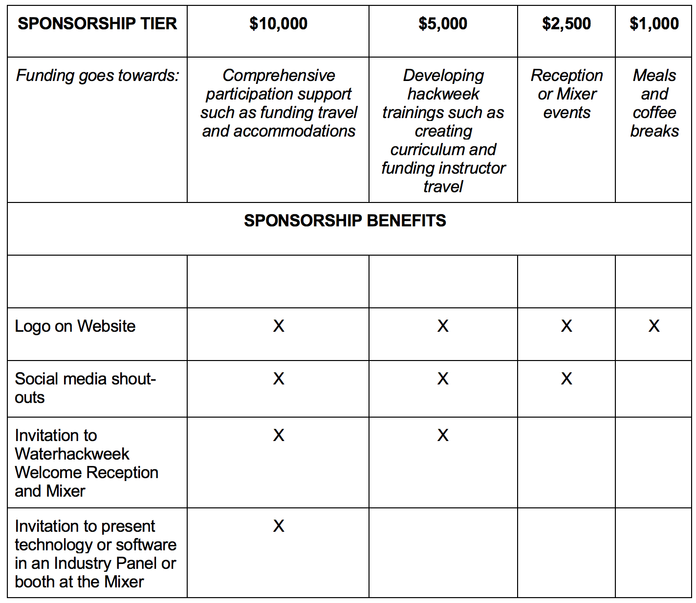

# Overview

We are currently recruiting sponsors for the 2019 Waterhackweek. 
# Roles and sponsorship tiers

 Sponsors will benefit from advertising their company, 
            networking with data scientists, discovering new technology and research and collaborating on projects. Other opportunities include sponsoring
            a need-based student to support diversity and education evaluation for hackweek best practices. 
            
   If you are intersted in sponsoring a Hackweek event (e.g. student-industry mixer, welcome and farewell receptions) please contact Rachel Murray at rlmurray@uw.edu.
            

As a hackweek sponsor for this event, your number one responsibility is also to adhere to the hackweek [code of conduct](https://waterhackweek.github.io/wiki/code_of_conduct.html) designed by the Seattle data science community. Your visibility throughout the event provides you with a unique opportunity to demonstrate professional, respectful behaviors that other participants can emulate throughout the week. 

# What can sponsors expect to gain from this experience?

This is an opportunity to build new contacts in the community, recruit students and generate new project ideas.  Participants will also have the opportunity to learn about you and your activities.